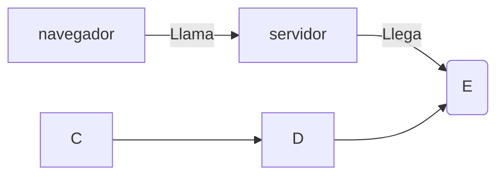

+++
title = 'Extensiones'
date = 2024-10-04T14:09:40+02:00
draft = false
wight = 30
+++

## Shortcodes 
La sintaxis para introducir un shortcode es la siguiente (la comilla no se pone, la coloco para que no salte error):
```php
{{`<>}}
```
Introducimos un shortcode de un video:
``` php
{{\<youtube IEwL-TZBeqQ>}}
```


El shortcode del boton es de la siguiente manera: 
```php
{{`<button>}} el texto de dentro {{`</button>}}
```
Esto es un boton 

## Crear diagramas

La orientacion depende de las primeras letras LR BT TB ... (Left-Right, Button-Top, ...)
```php
graph LR
navegador --Llama--> B[servidor]
B --Llega--> E(E)
C --> D
D --> E
```
Si nos fijamos al identificar el contenedor con [] se queda cuadrado pero si lo hacemos con () se queda redondeado


